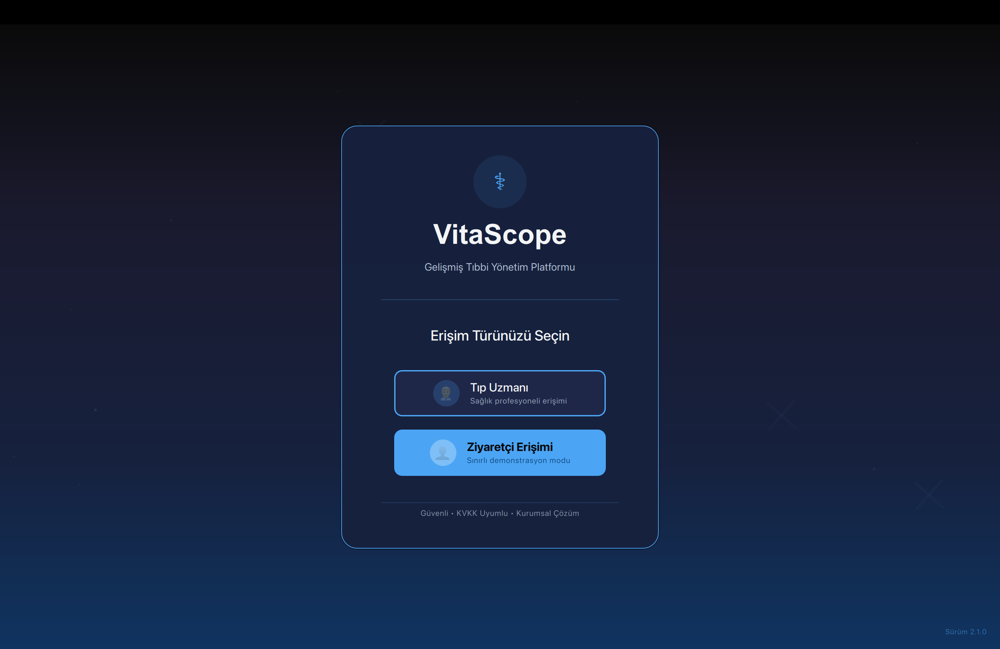
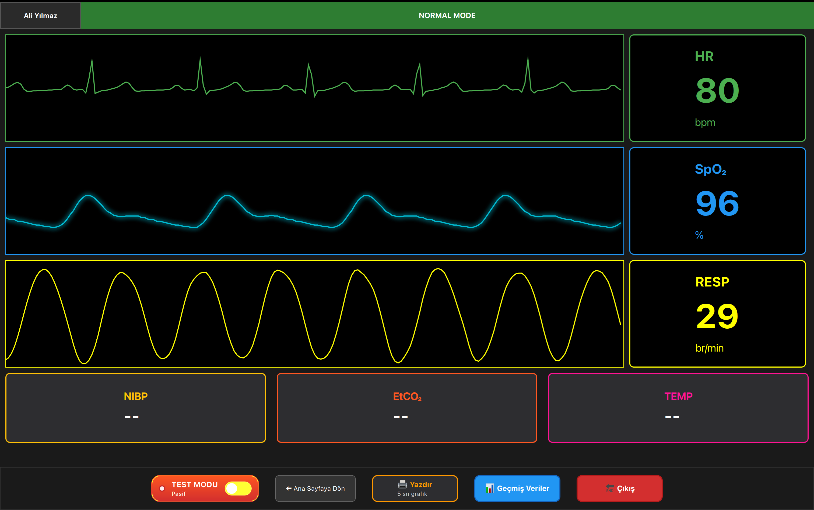
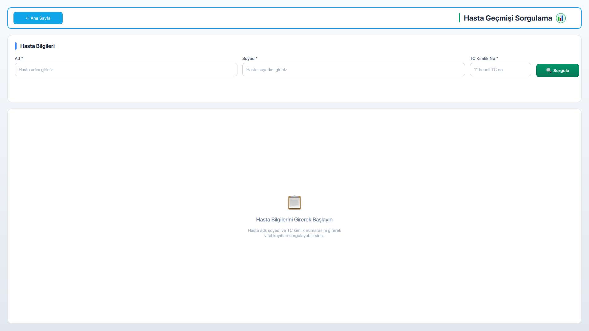
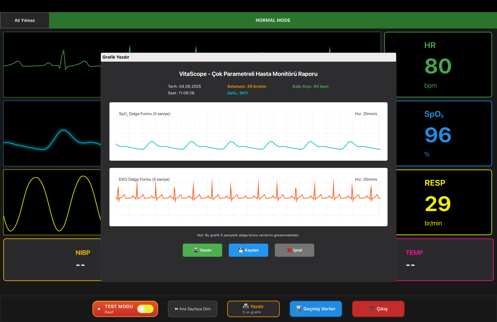
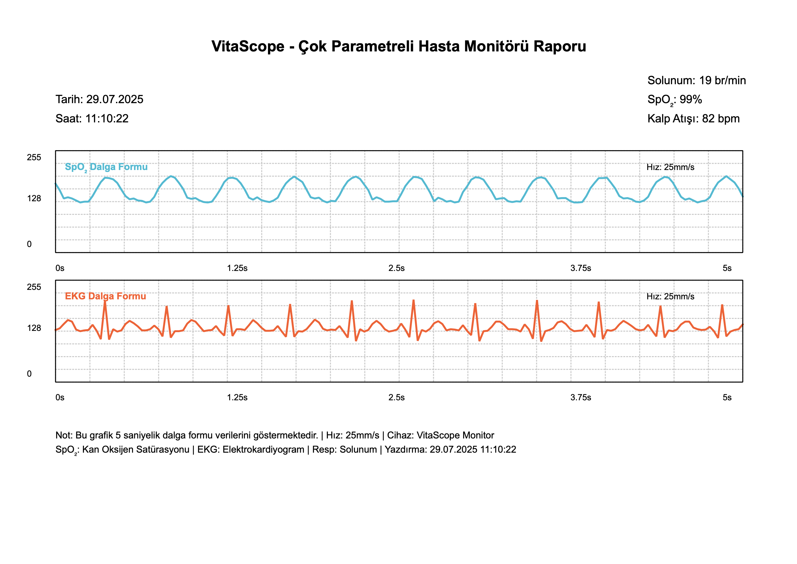
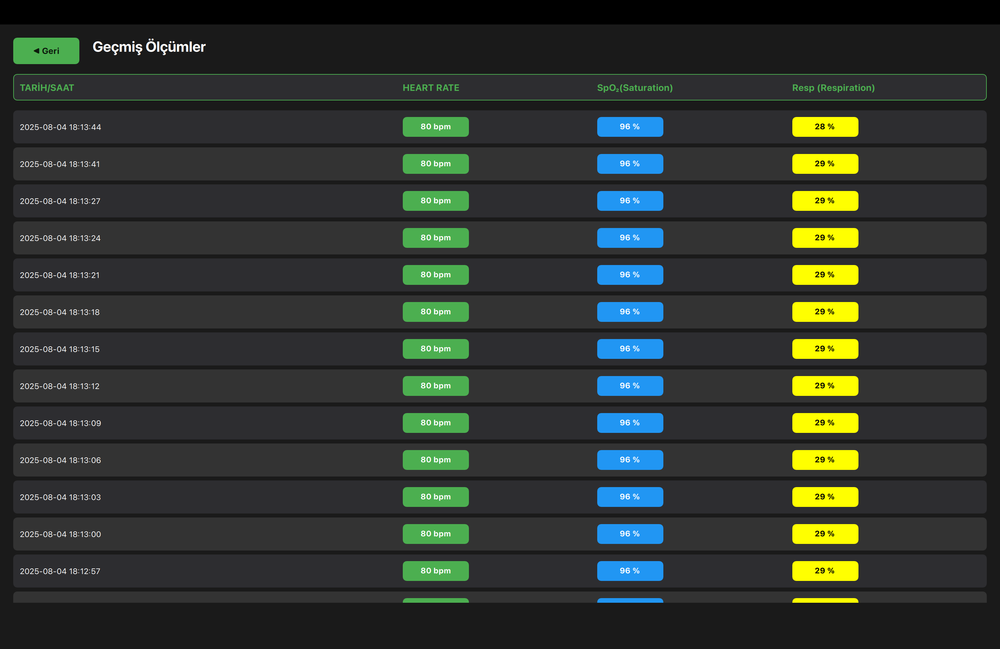
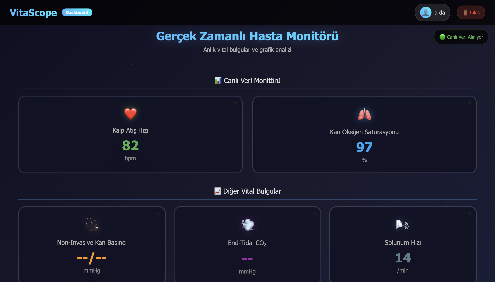
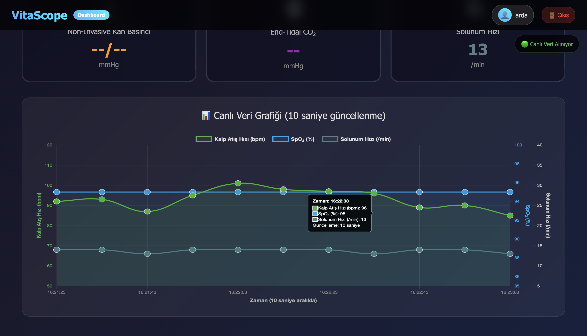
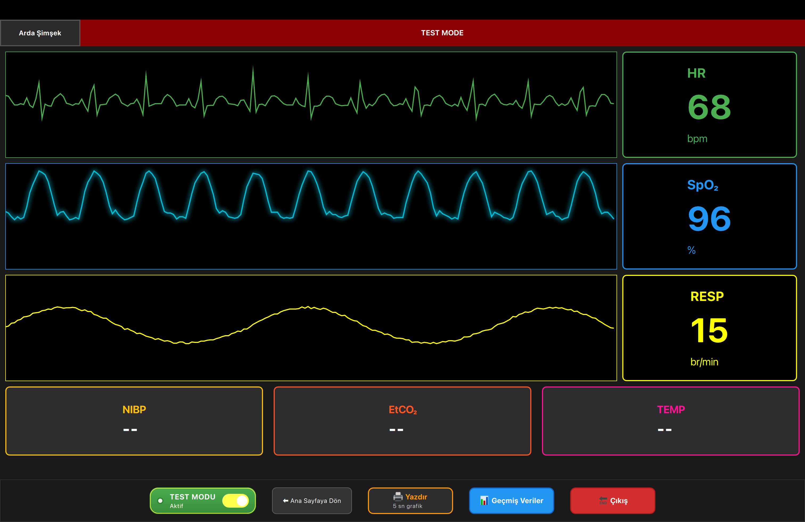

# Bedside Patient Monitor — Qt/QML Client + Flask Web Server

> Educational/research project. **Not a medical device** and **not for clinical use**.

A cross-platform bedside patient monitor UI built with **Qt/QML** and a **Flask** web server for data ingestion, authentication (email OTP), and dashboards. The system renders real-time vitals (HR, SpO₂, RESP), plots waveforms, and supports printable snapshots.

---

## 🔍 Key Features

- 💻 **Qt/QML bedside client**
  - 📊 Real-time HR, SpO₂, RESP values
  - 📈 ECG/SpO₂/Resp waveform rendering (QML `Canvas`)
  - 🖨️ Print/export 5-second snapshot (Qt `QPrinter`)
  - 🩺 Role-based flows (Doctor / Guest)
  - 👥 Multi-patient management with SQLite
- 🔌 **Device protocol**
  - 🔗 Integrates with **pSMM-V12.1** (e.g., Biolight SpO₂ module)
  - ⚙️ Custom baud rate on macOS via `termios + IOSSIOSPEED`
- 🌐 **Flask web server**
  - 🩺 Role-based flows (Doctor / Guest)
  - 📧 Email OTP authentication (Flask-WTF)
  - 🔄 REST ingestion endpoint (`/api/data`)
  - ⏱️ Basic rate limiting
- 🗂️ **Project hygiene**
  - 🧹 Clear repository layout
  - 📦 Ready-to-use `.gitignore`, `.env.example`, and starter CI (server)

> ⚠️ This repository is intended for learning and experimentation only.

---

## 🧰 Tech Stack

| Layer            | Technologies & Tools                                                                                               | Purpose                                                                                 |
|------------------|--------------------------------------------------------------------------------------------------------------------|-----------------------------------------------------------------------------------------|
| **Hardware**     | Medical sensor module (**pSMM-V12.1**, e.g., Biolight SpO₂), USB Serial                                             | Captures vital sign data from patient                                                   |
| **Desktop App**  | **Qt 6**, **QML**, **C++17**                                                                                        | Real-time UI for HR, SpO₂, RESP, ECG waveforms; local data management                   |
| **Backend**      | **Python 3**, **Flask**                                                                                             | REST API for data ingestion, role-based access, and authentication                      |
| **Database**     | **SQLite**                                                                                                          | Local patient records storage (multi-patient support)                                   |
| **Auth**         | **Flask-WTF**, **Flask-Login**, **Flask-Limiter**, **Email OTP**                                                    | Secure authentication with role separation (Doctor / Guest)                             |
| **Printing**     | **Qt PrintSupport**                                                                                                 | Generate and print 5-second waveform snapshots                                          |
| **Communication**| **Serial Port** (QtSerialPort) + custom baud setting (`termios + IOSSIOSPEED` on macOS)                            | Device-to-client data transmission                                                      |
| **Web UI**       | **HTML**, **CSS**, **JavaScript**                                                                                   | Web dashboard for viewing vitals                                                        |
| **Version Control** | **Git**, **GitHub**                                                                                              | Source code management and collaboration                                                |
| **CI/CD**        | **GitHub Actions**                                                                                                  | Automated server build and lint checks                                                  |
| **Documentation**| **Markdown**, `docs/` folder                                                                                       | Technical and user documentation                                                        |

---

## 🏗️ System Architecture

The **Bedside Patient Monitor** system follows a modular architecture, combining a Qt/QML desktop client for real-time monitoring with a Flask-based backend for data storage, remote access, and role-based dashboards.

---

### **Data Flow Overview**
1. **Sensor Module** sends patient vitals (HR, SpO₂, RESP, ECG) via **Serial Port**.  
2. **Qt DeviceManager** parses **pSMM-V12.1** packets and validates measurements.  
3. **Qt/QML UI** displays vitals in real-time, renders waveforms, and stores them in **SQLite**.  
4. **Flask Web Server** periodically receives updates from the client via **REST API** (`/api/data`).  
5. **Web Dashboard** displays patient information depending on **user role** (Doctor / Guest).  
6. **Authentication Layer** secures access via **Email OTP** and role-based permissions.

---

### **Architecture Diagram**

```
+-------------------+ Serial Data +---------------------+
| Sensor Module | --------------------> | Qt DeviceManager |
| (pSMM-V12.1) | | (Packet Parsing) |
+-------------------+ +---------------------+
|
v
+---------------------+
| Qt/QML UI Client |
| (Waveforms, Values) |
+---------------------+
|
Local Storage | REST API
+--------------------+------------------+
| |
v v
+------------------+ +----------------------+
| SQLite DB | | Flask Web Server |
| (Multi-patient) | | (/api/data endpoint)|
+------------------+ +----------------------+
|
Role-based Access (Doctor / Guest)
|
v
+-----------------------------+
| Web Dashboard UI |
| (Vitals, Waveforms, Reports)|
+-----------------------------+
```
---

### **Key Components**
- **Sensor Module (pSMM-V12.1)** – Acquires medical-grade vitals data.
- **Qt DeviceManager** – Reads and parses serial packets, validates data.
- **Qt/QML Client** – Renders waveforms, displays values, prints snapshots.
- **SQLite DB** – Stores patient-specific historical data.
- **Flask Server** – Provides REST API, manages auth, serves web UI.
- **Web Dashboard** – Enables remote monitoring with role-based data visibility.

---

## 📁 Project Structure
```
bedside_patient_monitor/
├── client-qt/                  # Qt/QML desktop patient monitor
│   ├── bedside_monitor.pro      # qmake project file
│   ├── main.cpp                 # Application entry point
│   ├── main.qml                 # Root QML file
│   ├── database.cpp / .h        # SQLite integration
│   ├── devicemanager.cpp / .h   # Serial communication & data parsing
│   ├── print.cpp / .h           # Printing via QPrinter
│   ├── smmprotocoltest.cpp / .h # pSMM-V12.1 protocol handling
│   ├── testmode.cpp / .h        # Test data simulation
│   ├── components/              # QML component modules
│   │   ├── doctor/              # Doctor UI components
│   │   │   ├── BottomBar.qml
│   │   │   ├── BottomVitalsRow.qml
│   │   │   ├── DoctorLogin.qml
│   │   │   ├── DoctorRegister.qml
│   │   │   ├── DoctorView.qml
│   │   │   ├── history.qml
│   │   │   ├── PatientSelector.qml
│   │   │   ├── PrintDialog.qml
│   │   │   ├── TestModeButton.qml
│   │   │   └── VitalsGraphRow.qml
│   │   └── visitor/             # Visitor UI components
│   │       └── VisitorView.qml
│   └── build/                   # Build artifacts (ignored in VCS)
│
├── server-flask/                # Flask backend (web dashboard & API)
│   ├── app.py                    # Main Flask app
│   ├── forms.py                  # WTForms definitions
│   ├── otp.py                    # OTP generation & validation
│   ├── otp_form.py               # OTP form handling
│   ├── veriler.db                # SQLite database (example)
│   ├── templates/                # HTML templates
│   │   ├── index.html
│   │   ├── login.html
│   │   ├── register.html
│   │   ├── otp.html
│   │   └── static/               # Static files for templates
│   │       ├── css/
│   │       │   ├── style.css
│   │       │   ├── login.css
│   │       │   ├── register.css
│   │       │   └── otp.css
│   │       └── js/
│   │           ├── script.js
│   │           ├── login.js
│   │           ├── otp.js
│   │           └── register.js
│
├── docs/                         # Documentation and media
│   └── screenshots/
│
├── .gitignore                    # Ignored files configuration
├── LICENSE                       # MIT license
└── README.md                     # Project documentation

```

---

## 📸 Screenshots / Media

### 👤 User Roles & Views
<p float="left">
  
  
  
</p>

### 🖨️ Printing & Reports
<p float="left">
  
  
  
</p>

### 🌐 Web Interface
<p float="left">
  
  
</p>

### 🧪 Test & Debug Modes
<p float="left">
  
</p>

---

## 👨‍💻 Developer
- Arda Şimşek

---

## 📌 License

This project is licensed under the [MIT License](LICENSE).


